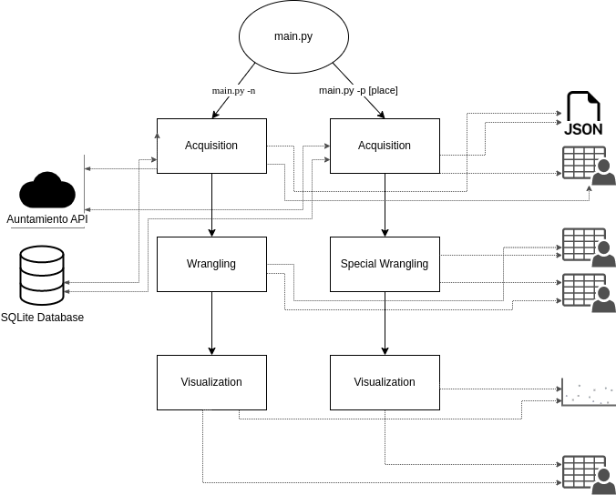
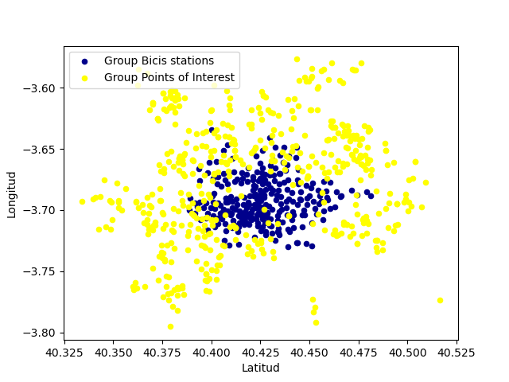

# Estaciones BiciMad
El objetivo de este proyecto ha consistido en crear un programa en python que te permita saber cuál es la estación de BiciMad más cercana a un centro deportivo del ayuntamiento de Madrid.

## Descripción

Este proyecto utiliza Python para realizar la ETL de datos. Primero, se extrae información de la API del ayuntamiento de Madrid y de una base de datos Duckdb utilizando librerías como `requests` y `duckdb`. Luego, se transforman los datos utilizando librerías como `pandas` y `geopandas` para calcular las estaciones de BiciMad más cercanas a nuestros puntos de interés. Finalmente, se crea un DataFrame con esta información. Durante todas las etapas del dato, se almacena la información en distintos CSVs, de esta forma garantizamos el linaje del dato.

## Diagrama de flujos




## Dependencias

Para poder ejecutar este proyecto, se necesitan las siguientes dependencias:

- Python 3.7 o superior
- Librerías de Python: requests, duckdb, pandas, matplotlib, fuzzywuzzy, geopandas


## Instalación y configuración

Para instalar las dependencias necesarias, se puede utilizar el archivo `requirements.txt` que se encuentra en la raíz del proyecto. Para instalar las dependencias, se debe ejecutar el siguiente comando en la terminal:

```bash
git clone https://github.com/Glopez-a/m1_project.git
pip install -r requirements.txt
```

## Ejecución

Para ejecutar el programa, se debe utilizar el archivo principal `main.py` que se encuentra en la raiz del proyecto. Para ejecutar la ETL, existen dos posibles opciones. Ejecuta el siguiente comando para más información:

```bash
python main.py -h
```

## Visualización

Además de los CSVs, se creará un plot parecido al que se muestra a continuación:



## Autores

Este proyecto fue creado por [Gonzalo López](https://github.com/Glopez-a)

